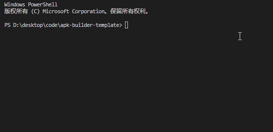

# apk-builder-template

template for <a href="https://github.com/gityoog/node-apk-builder.git">node-apk-builder</a>

## 安装

```
$ git clone https://github.com/gityoog/apk-builder-template.git
```

依赖构建工具: `javac` & `android-sdk (build-tools, platforms)`

```
$ sdkmanager "build-tools;version" # 安装build-tools, version为版本号, 如30.0.3

$ sdkmanager "platforms;version" # 安装platforms, version为版本号, 如android-30
```

先安装 `sdkmanager`, 再使用 `sdkmanager` 安装 `build-tools` 和 `platforms`

## 使用

```
$ npm run dev # for debug apk

$ npm run build # for release apk
```



## 配置

```ts
// script/config/index.ts

/** apk输出目录 */
dist: string;

/** 源码目录 */
src: string;

/** android.jar 位置 (android_sdk/platforms/version/android.jar) */
androidJar: string;

/** 添加构建工具目录 (如: android_sdk/build-tools/version/) */
buildTools: string;

/** 是否需要显示打包进程 (default: true) */
render?: boolean;


/** apk签名文件位置 目前只支持 pk8+pem 后续会增加 */
sign: {
  key: string;
  cert: string;
};

/** 开启adb自动安装自动运行 main为自动启动路径 package/.activity*/
adb?: {
  main: string;
};
```
